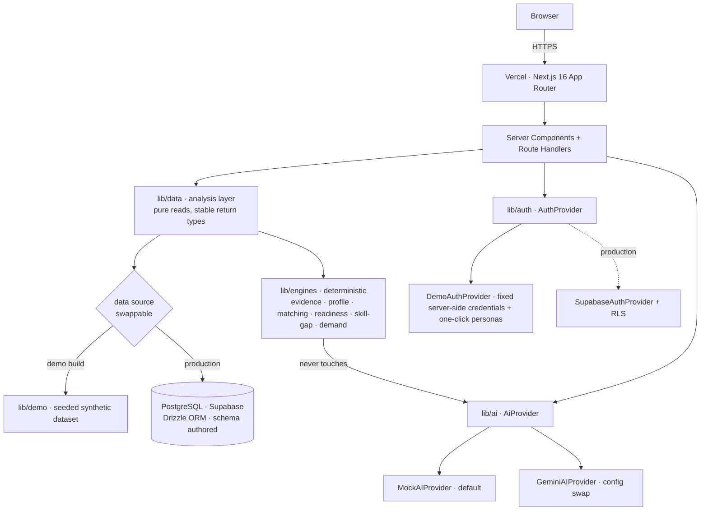
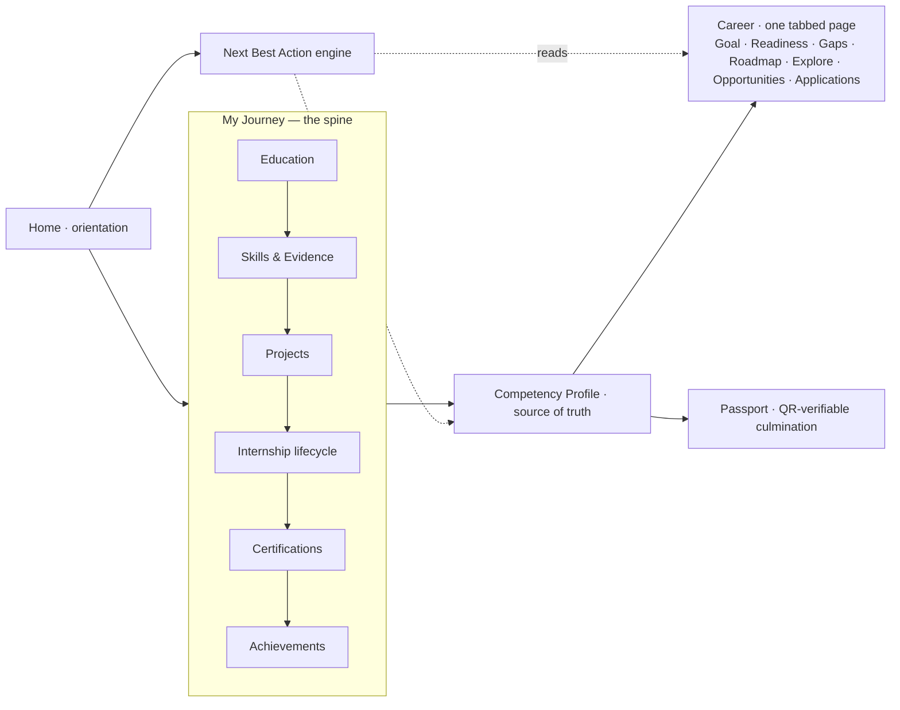
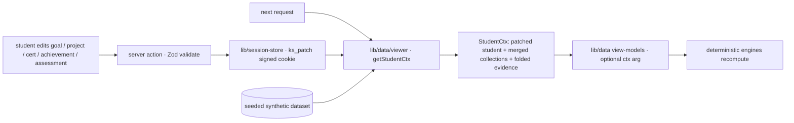
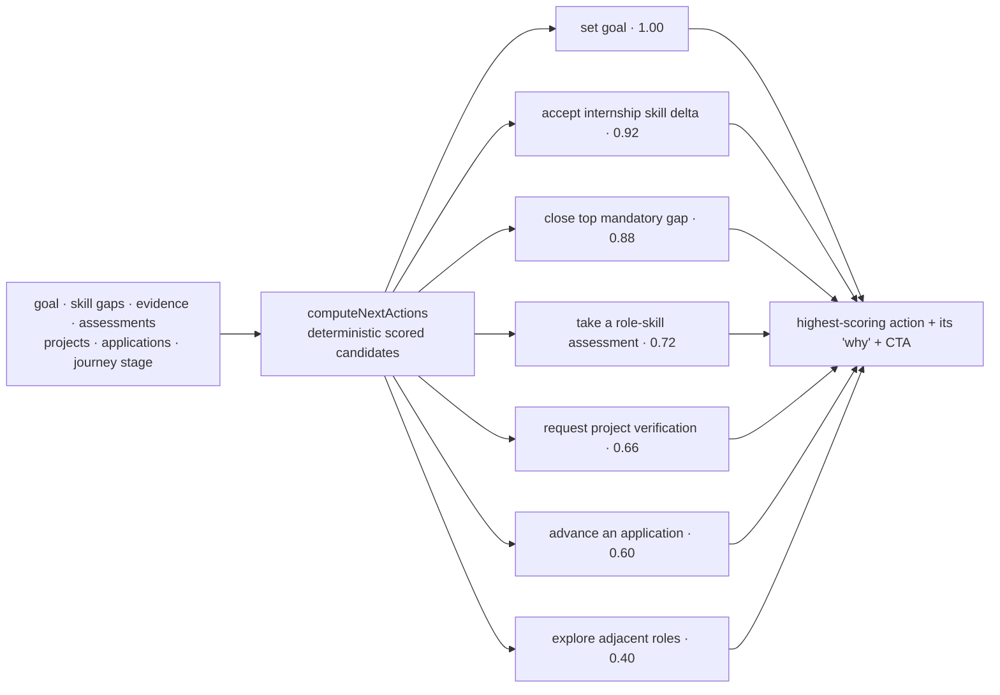
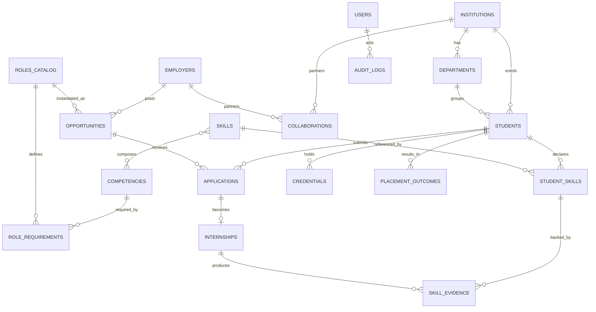
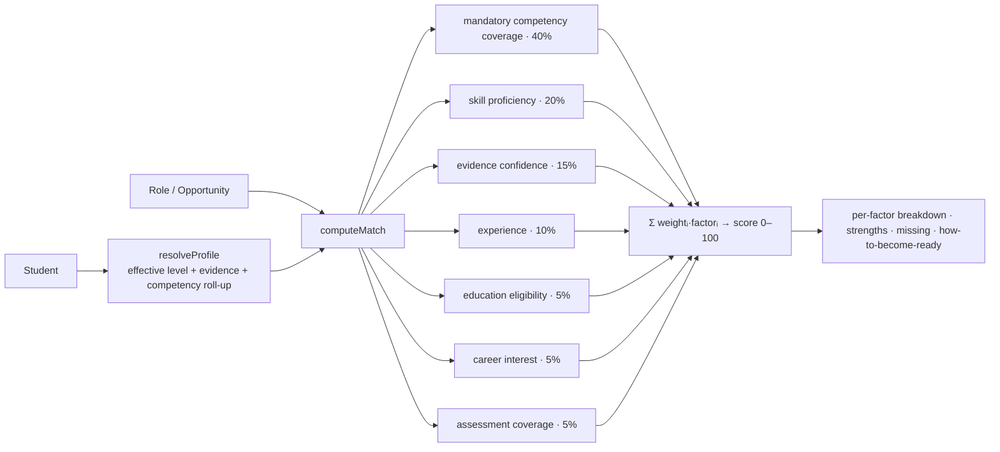
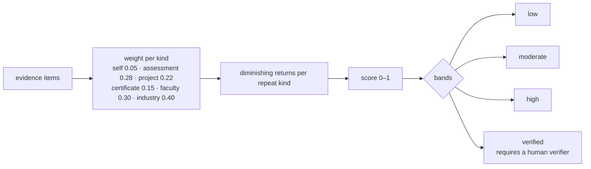
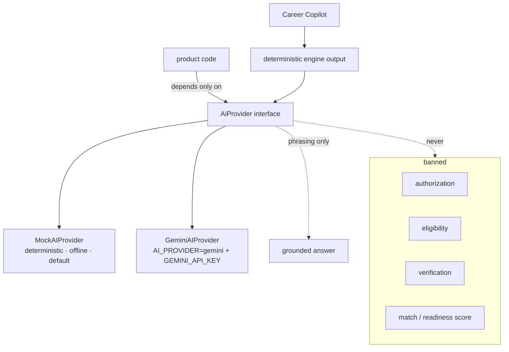
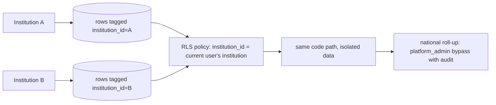
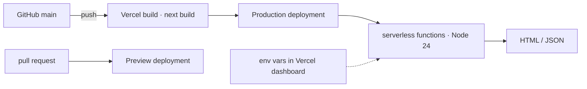

# ARCHITECTURE — KaushalSetu

## System



## Information architecture (student)



Every input (course grade, project evaluation, certification, achievement,
internship skill delta, faculty/industry verification) flows into the Competency
Profile; the Profile feeds Career readiness, matching and the Passport. Nav is
four destinations: Home / My Journey / Career / My Profile. A `⌘K` command
palette addresses every page and quick action.

### Editable demo data (no database)



The patch is **per browser session** (cleared on sign-out / redeploy), bounded
in size (cookie), and not shared with other roles' views. `lib/data` functions
take an optional `StudentCtx`; omitted → base dataset, identical behaviour, so
tests and the recruiter/faculty/institution paths are unaffected. Production
replaces `lib/session-store` with real writes; the engines and view-models do
not change.

## Next Best Action engine



Pure function over engine output — no model call. AI may later phrase the "why",
never choose the action.

## Data model (production schema — `lib/db/schema.ts`, authored)



Every tenant-scoped table carries `institution_id`; production enforces
Row-Level Security on it.

## Matching engine



The identical function serves the student feed and the recruiter ranking.

## Evidence Confidence



## AI architecture



## Auth & authorization

```mermaid
flowchart TD
  REQ[request] --> AP[AuthProvider.resolveSession · ks_session httpOnly cookie]
  AP --> P{persona / session}
  P -->|none| LOGIN[/login]
  P -->|wrong role| HOME[own workspace home]
  P -->|ok| GUARD[requireRole in the page]
  GUARD --> RENDER[server component renders]
  RENDER -.production.-> RLS[Postgres RLS filters by institution_id]
```

Demo build: `AuthProvider` interface with `DemoAuthProvider` — credentials live
**server-side only** (never shipped in client JS); judges also get a
passwordless one-click persona path. `requireRole(...roles)` guards every
workspace route: no session → `/login`, wrong role → your own home. Swapping to
`SupabaseAuthProvider` (`@supabase/ssr`) + RLS is a one-line change in
`lib/auth/session.ts`.

## Multi-tenancy



## Deployment / data flow



## Key decisions

| Decision                                     | Why                                                                     |
| -------------------------------------------- | ----------------------------------------------------------------------- |
| Data source behind `lib/data`                | Demo runs zero-setup; production schema drops in unchanged              |
| Deterministic engines, config-driven weights | Auditable, testable, reproducible; not a model                          |
| AI abstraction, mock default                 | Works with no key; Gemini is configuration                              |
| Drizzle over Prisma                          | Serverless cold-start; tiny runtime; plain SQL migrations               |
| `AuthProvider` interface, demo default       | One-click judge access now; Supabase is a one-line swap                 |
| One journey spine, four nav destinations     | Product is "my academic → skill → career journey", not a dashboard grid |
| Deterministic Next Best Action               | One honest highest-leverage move; auditable, never a model guess        |
| Synthetic dataset, labelled everywhere       | Honest; no fabricated government data                                   |
